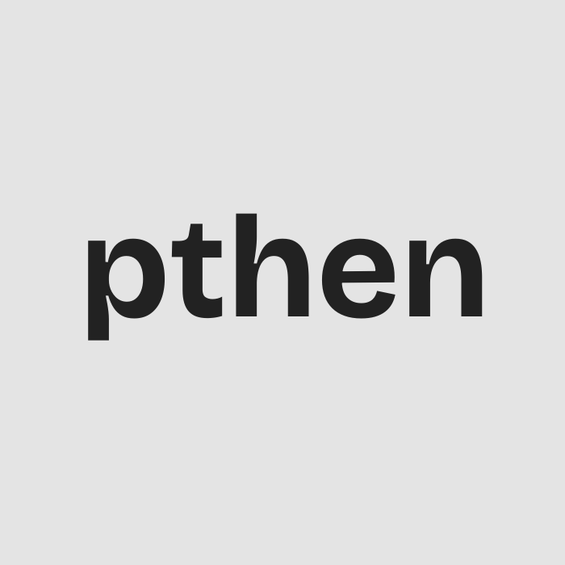

# PTheN's Portfolio

  

Welcome to my website's repository.

This portfolio is intended for personal and educational purposes only. This is a way for me to learn how to create and design websites using dedicated tools and workflows (for bigger future projects), while also having fun doing something I can maintain in a long term.

# Setup

This project requires / currently uses:

🌼 DaisyUI - 5.5.23 (or higher)
🍃 Tailwind - 4.3.0 (or higher)

# Copyright Notice

This website and repository reserves all rights to its owner. Thus, it is source-available, but not open-source.

© 2026 PTheN Official

This could probably change in the future, but who else really cares about this project anyways?